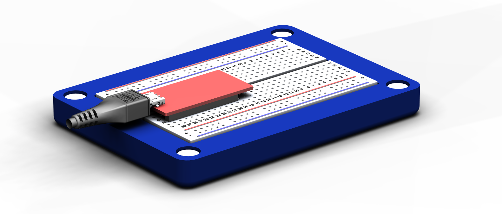

# HW4: A 3D Printed Breadboard Enclosure 

## Concept

This enclosure was designed so that the jumper wires did not need to be fully unplugged and stowed after each use, and circuits could be left assembled. We started by sketching out what we wanted it to look like. 

We chose to use magnets to attach the top and the base because we did not want to carry around a screwdriver to take it apart every time we wanted to use it. The magnets are neodynium, and based on past projects we know they are strong enough to hold together the enclosure. They are intentionally sunken into their holes, to prevent them from crashing into each other and shattering when the top and base are joined. This also reduces their attractive force, which is necessary because they are extremely strong.

## 3D Modeling

This project was modeled in Siemens NX, and is intended to be printed on a Dimension 1200es 3D printer. This is a higher-end 3D printer, and allows us to design with tighter tolerances for a cleaner overall product.

First, a breadboard model was imported from <a href="https://grabcad.com/library/breadboard-for-electronics-projects-1" target="_blank">Grabcad</a>, and the base was built around it, The breadboard is glued into the base, sits slightly proud of the base for aesthetics as well as clearance between the base and the USB cable. The holes for the magnets are oversized to allow space for the glue to flow around them when they are installed. The RedBear Duo was measured with calipers, and a USB shell and cable tip were imported to locate the USB cable. 

Next, the top was modeled. To allow a user to close the case without having to remove components from the breadboard, the top shell extends 26mm above the top of the breadboard. The top uses a similar array of magnets glued in holes, and has filets at the corners as shown in this cross sectional view:  

A cutout was also designed for the USB cable, so the microcontroller could be powered on and used with the top on. Future versions of this product could have a transparent component in the top, so the circuit could be externally viewable. Here's a view with the top transparent, which shows how the two parts come together. 

## Modeling files

A zip of the modeling files and drawings can be found <a href="CAD/files.zip" target="_blank">here</a>. Since the part was modeled in NX it may not be viewable, so a STEP file was included as well. 

## 3D Printing
Stay tuned! We will be updating this once we print the part early next week. 

## Team

**Eric Burger**

**Nick Renda**

